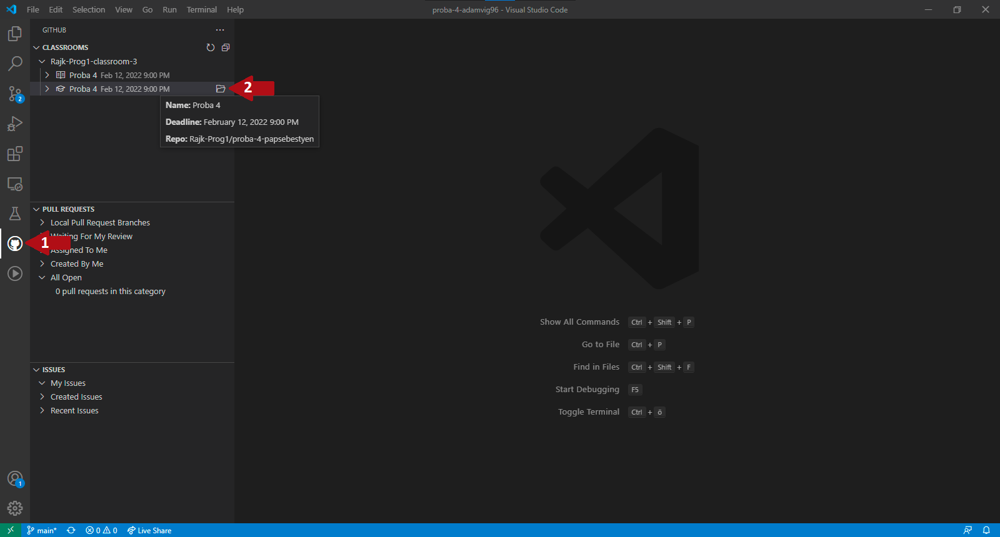
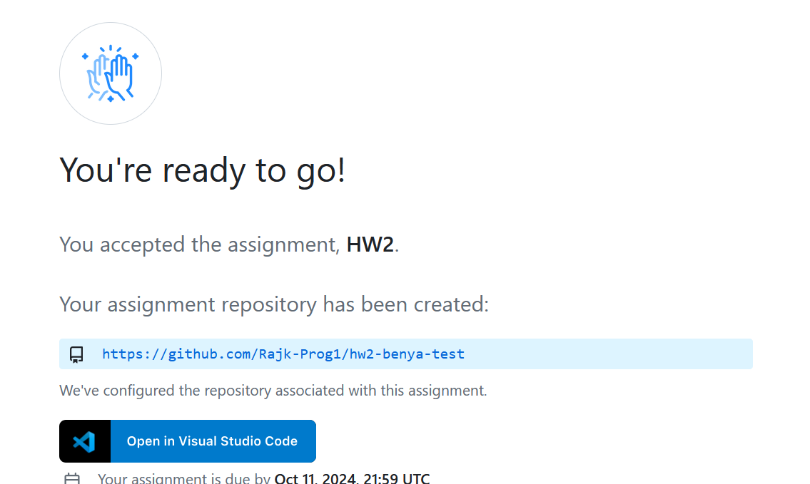
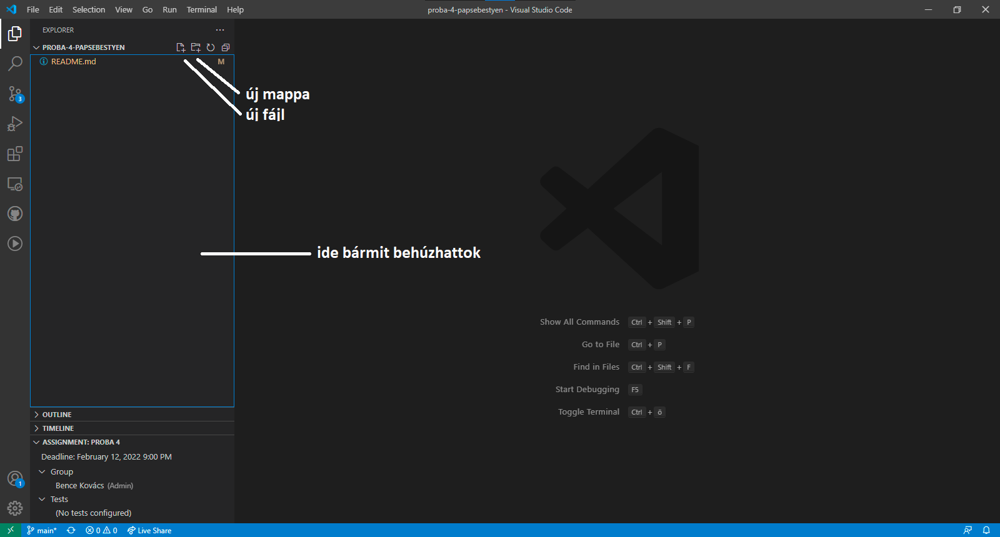
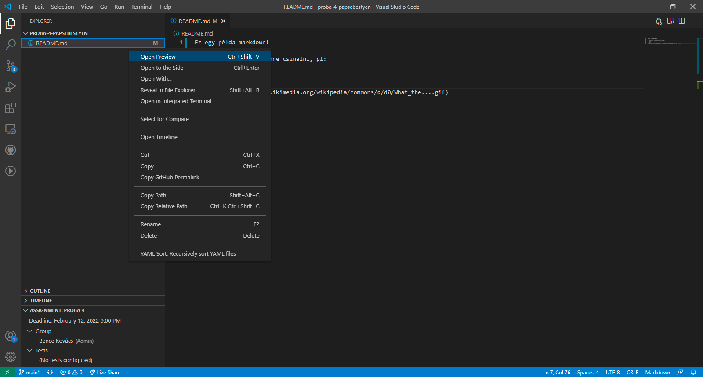
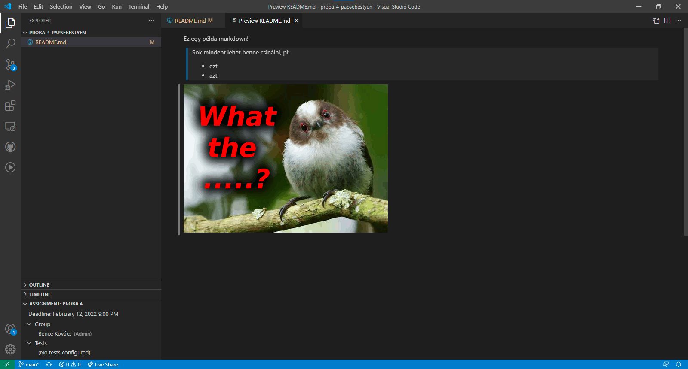
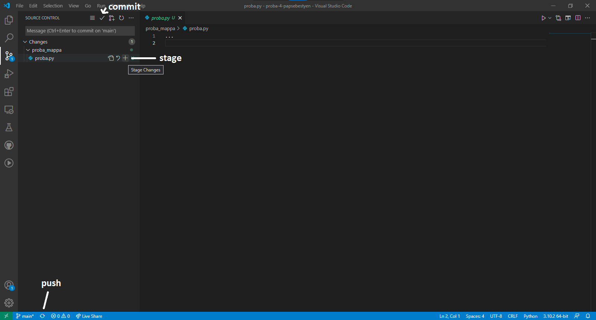
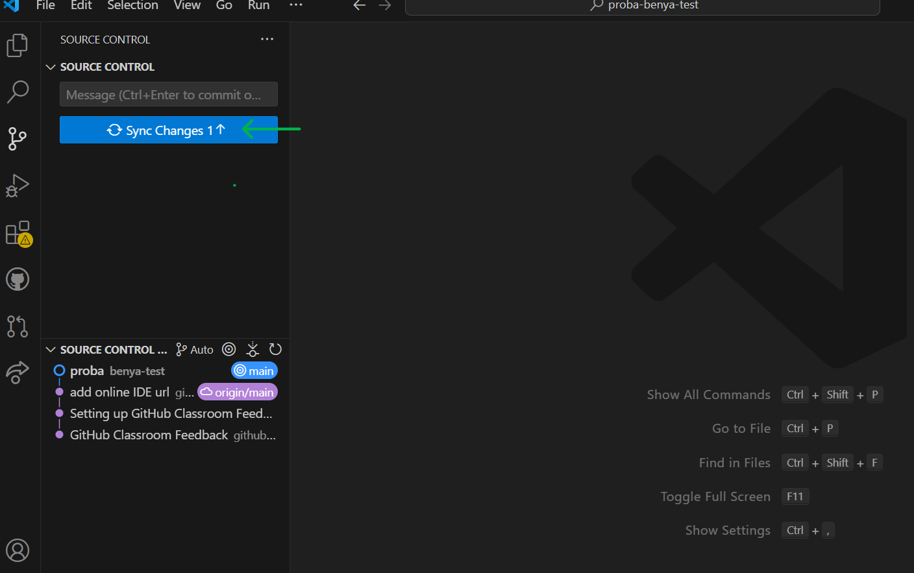
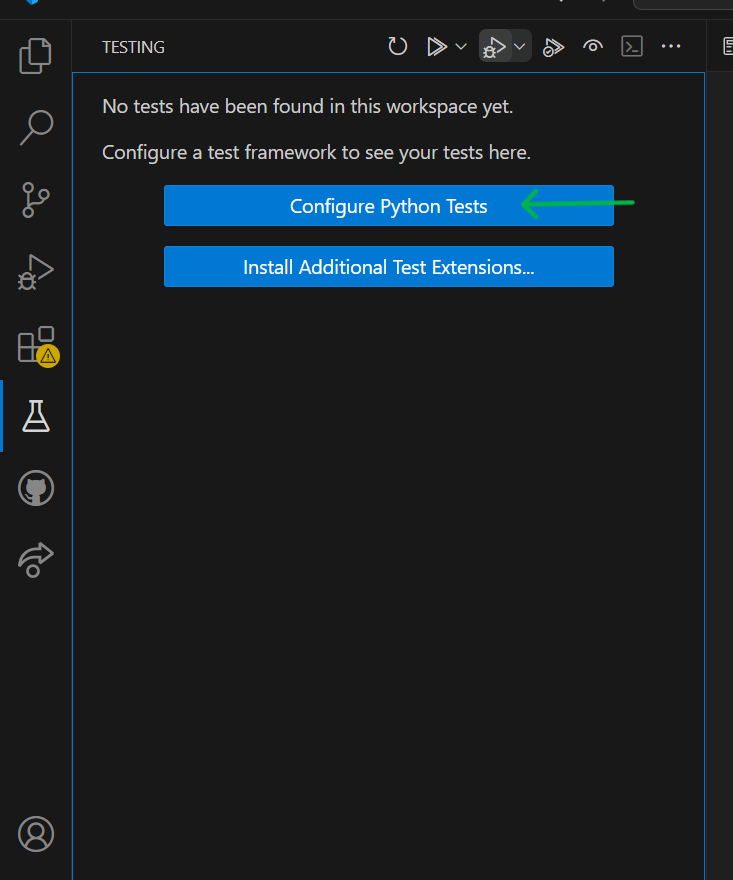
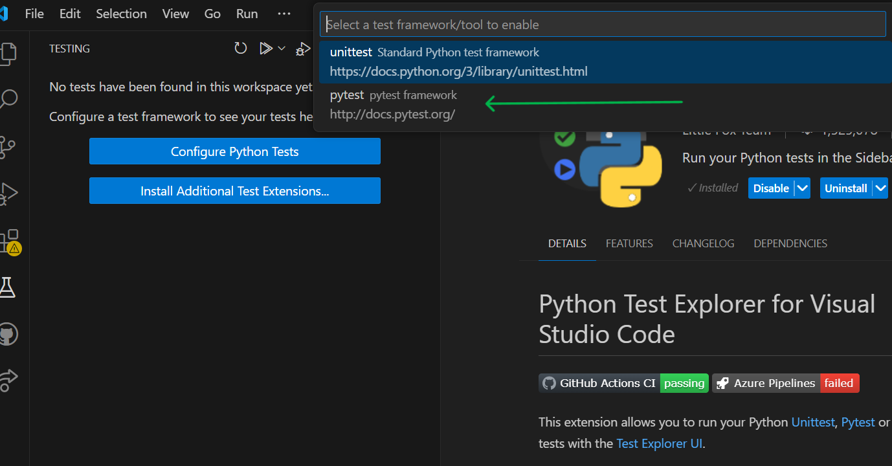
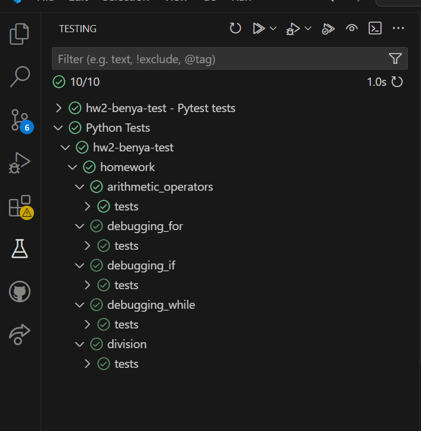

# Kurzus Házi Feladat Infrastruktúra
{:.no_toc}

## Tartalomjegyzék
{: .no_toc .text-delta }

1. TOC
{:toc}

---

## VS Code

A **Visual Studio Code** egy Microsoft által kiadott IDE (_Integrated Development Environment_), amely számos hasznos funkcióval rendelkezik, például a **GitHub Classroom** funkcióval is. Ha még nem telepítettétek meg, akkor tegyétek meg [innen](https://code.visualstudio.com/).

> Később szó lesz még róla, hogy mi az az IDE, de most egyelőre fogjátok fel úgy, hogy egy felpimpelt szövegszerkesztő.

Miután elfogadtok egy nektek kiküldött assignmentet, létre fog jönni egy saját **repository** minenki nevére.

> A repository egy olyan mappára utal, amelyben valamilyen verziókövető rendszer folyamatosan figyeli a változásokat. Később szó lesz még róla a kurzuson.

A nektek létrehozott repositoryban tudtok majd házit leadni, de ehhez először le kell töltsétek a saját gépetekre a GitHub-ról.

## Git telepítése

Telepítsétek [innen](https://git-scm.com/downloads) git-et a gépetekre. Nem kell semmi különlegeset beállítani a telepítésnél. Erre azért van szükség, hogy a VS Code segítségével fel tudjátok tölteni a házit a gépetekről a GitHub-ra.

Ezt követően egy terminálban az alábbi két parancsot kell kiadnotok:

```bash
git config --global user.email "you@example.com"
git config --global user.name "Your Github Name"
```

> A terminálról (CLI) még szó lesz később. Windows-on _cmd_/_powershell_, MAC-en _terminal_ név alatt találjátok meg.

## VS Code kiegészítők telepítése

A 2. házi kiírásához csatoltam egy `extensions` nevű fájlt, ezt töltsétek le. Nyissatok egy terminált oda, ahova letöltöttétek ez a fájlt és futtassátok a következő parancsot:

Windows Command Prompt:

```bash
for /f "tokens=*" %i in (extensions) do code --install-extension %i
```

Windows PowerShell:

```bash
Get-Content extensions | ForEach-Object { code --install-extension $_ }
```


Mac:

```bash
while read extension; do code --install-extension "$extension"; done < extensions
```

Ezzel települ minden olyan bővítmény a VS Code-ba, amire a kurzus elején szükségetek lehet. Egyébként a VS Code-on belül jobb oldalon az **Extensions** fül alatt tudtok kiegészítőket telepíteni.

## VS Code Mappastruktúra

Miután települt a bővítmény, jobb oldalt látni fogjátok a GitHub logót. Ha rámentek az alábbi képet kell lássátok:



Fent láthatjátok az egyes elfogadott assignmenteket. Ezeknek a linkjét csatolom az egyes háziknál. A link megnyitása után a repository sikeres létrehozása után egy ehhez hasonló képet fogtok látni:



Itt válasszátok ki azt amelyiken dolgozni akartok és a kis mappa ikonnal nyissátok meg.

A VSCode-ban mindig egy adott mappában (repositoryban) tudtok dolgozni. Az ott levő mappákat és fájlokat az **explorer fülön** láthatjátok (_mappa ikon bal fent_).



Itt hozhattok létre új fájlokat és mappákat is, de a gépetekről is behúzhattok ide, amit csak akartok (pl képeket).

## Markdown

A Markdown egy egyszerű jelölőnyelv formázott szöveg létrehozásához. Például ez a dokumentum is markdownban készült. **A házifeladatok leírását is ebben fogjátok megkapni!**

A markdown fájloknak .md kiterjesztése van, és alapból nem igazán látványosak. Ahhoz, hogy embernek is olvasható legyen **renderelni kell valahogy**.

Ezt a GitHub oldalon alapból megtörténik, de a VSCode-ban nem. Ott, ha rámentek egy markdown fájlra és jobb klikk után kiválasztjátok az **Open Preview** opciót, akkor megjelenik a vizuális formája.



Íme:



## Házik leadása

A házik leadásához fel kell töltenetek a lokálisan (saját gépeteken) meglévő fájlokat a GitHub-ra.

Ehhez menjetek baloldalt a **Source control** fülre. Itt látjátok, hogy mi változott a repositoryban az utolsó mentett módosítás óta.

### **Leadás menete**

1. Ha fel akartok tölteni egy kész házit, akkor először bele kell tegyétek a **stage**-be a kis plusz ikonnal. Ezt minden olyan fájlal meg kell tenni, amit fel akartok tölteni!
2. Ha minden fontos fájl bent van a stage-ben, akkor a kis pipa ikonnal **commit**-olni kell a változásokat. Ez lényegében egy-egy verziója lesz a repositorynak. Fontos, hogy minden esetben írjatok valamit a **Message** részhez, mert nem tudtok üzenet nélkül commit-olni.
3. Ha ez is megvolt, akkor a lenti **push** gombbal kell feltölteni a változásokat a GitHub-ra. Innentől lesz számunkra is látható, hogy min és hogyan dolgozatok. A lenti **push** gomb alternatívája a **Sync Changes** gomb.





## Házik ellenőrzése VS Code-on belül

A VS Code-on belül tesztek futtatásához a bal oldali menün található lombikot kell kiválasztanotok. Az első megnyitást követően lehet, hogy néhány dolgot be kell állítanotok, ezeket a következő képet mutatják:




Ha ez sikerült, akkor minden házi esetében az ott megtalálható teszteket kell látnotok a bal oldali menüben. Ezek alapértelmezetten pirosak lesznek, ha megoldjátok az adott feladatot és újra futtatjátok a tesztet akkor fog zöldre váltani.


